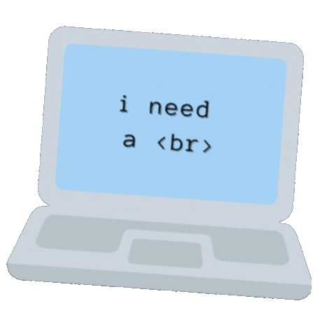

## Hi there! 

###  About Me:
---

- ✔️ Web Development, Cybersecurity, and Bug Bounty Enthusiast.
- 😄  I enjoy surfing 🏄‍♂️, cycling 🚴 , and playing chess ♟️ on my time off.
 
###  Technologies and Tools:
---
- ⌨️ **Scripting Languages:** Python, PHP, Bash 
- 💾 **Networking:** Network Fundamentals, TCP/IP, Virtualization, Wireshark, Packet Tracer. 
- 🕸️ **Web Technologies:** HTML, CSS/Bootstrap, Javascript, MySQL, AWS, Git, Docker. 
- 🔐 **Information Security** Suricata, pfSense, Kali, Metasploit, Nessus, OpenVAS, Nmap, NIST, OWASP. 

